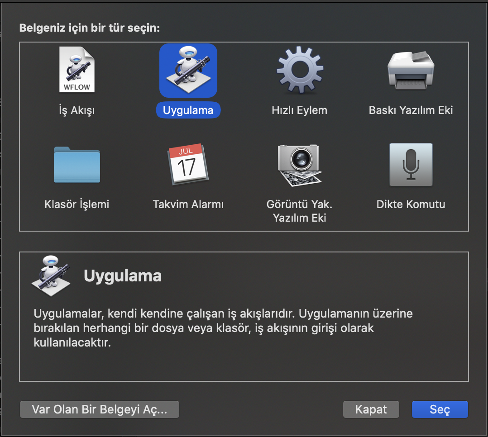
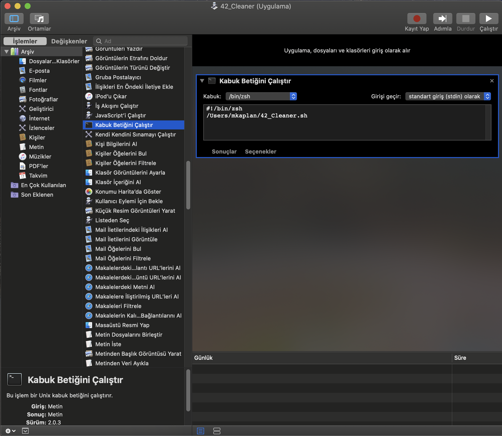
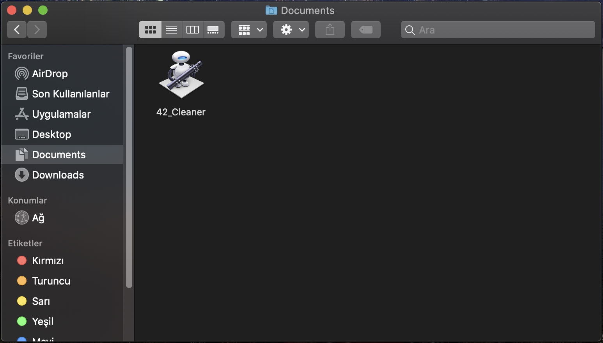
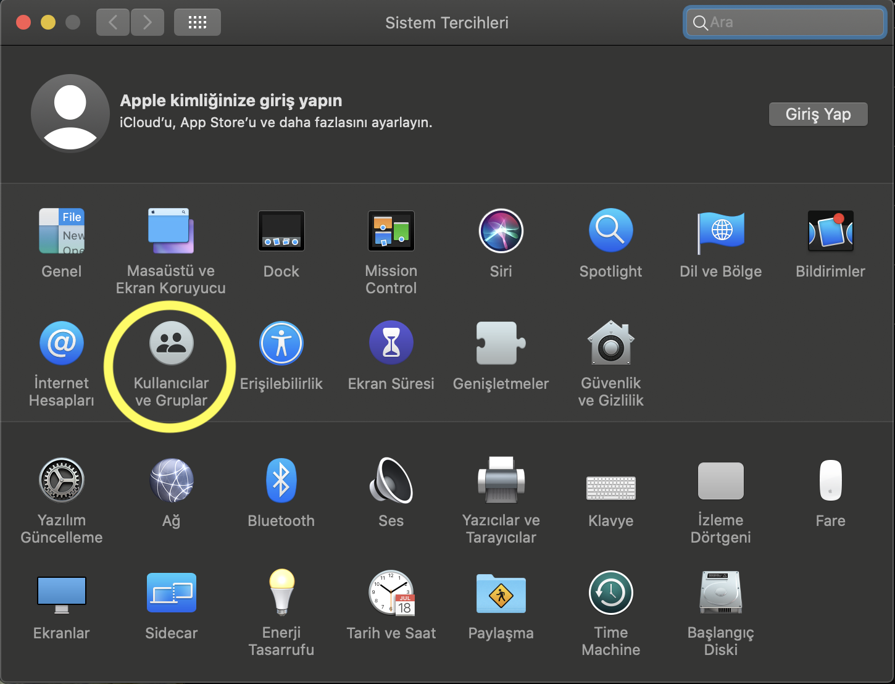
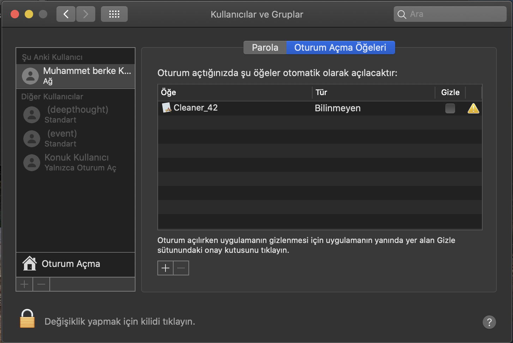

# 42_Cleaner

"First of all, this program is written for macOS. Run ./CleanerInstaller and then you can run the program anytime by typing cclean in the terminal."

If you want this program to open regularly at each login, you should use the Automator application. Open Automator, then select "Application" from the document type options, and double-click "Run Shell Script" from the menu that appears. In the opened section, enter the following commands:

#!/bin/zsh
/Users/username/42_Cleaner.sh

Replace username with your actual username. After saving the program, you can then select the Automator application you want to run at startup from System Settings -> Users and Groups.

